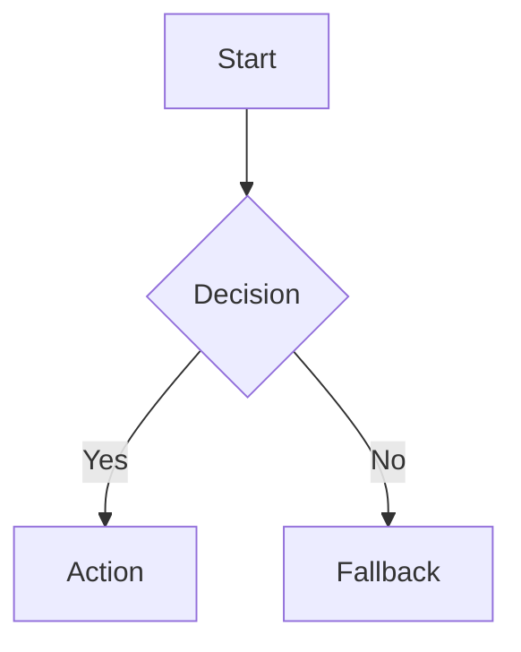
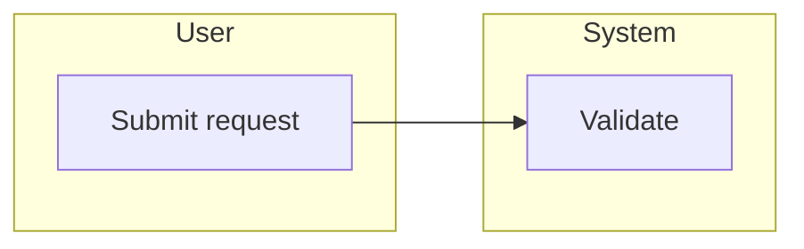
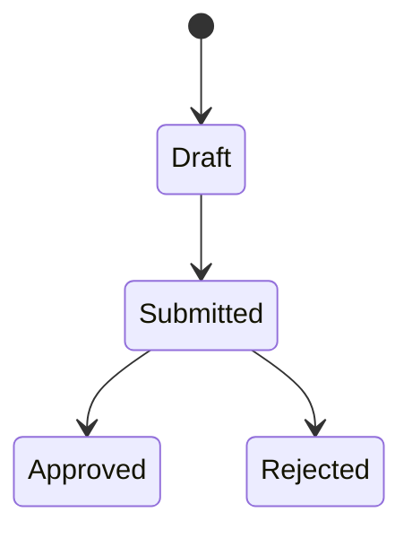
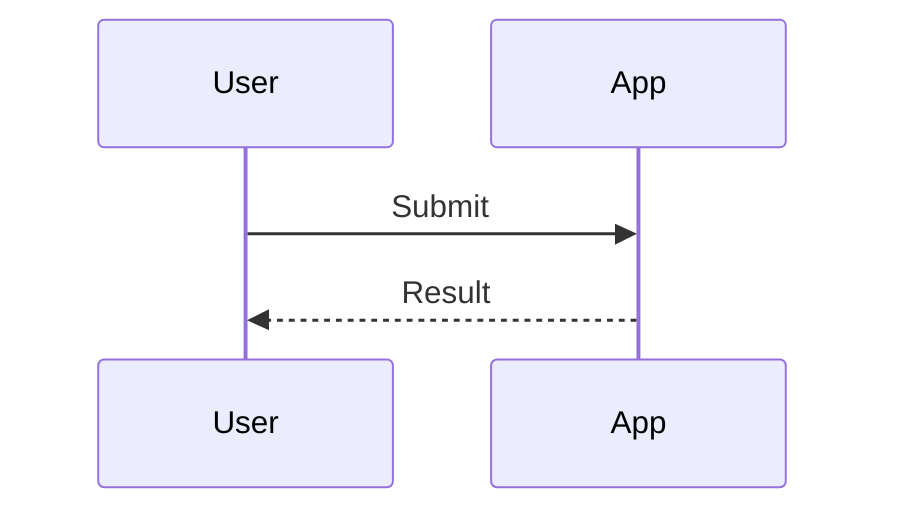

# Diagram Patterns

## Flowchart

Use for steps and decisions.

## Swimlane-Style Flow

Mermaid does not have a native swimlane primitive. Use subgraphs for lanes.

## State Diagram

Use for lifecycle transitions.

## Sequence Diagram

Use for time-ordered interactions.

