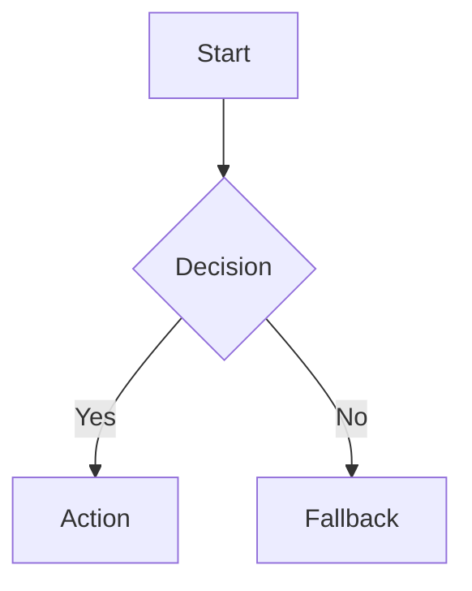
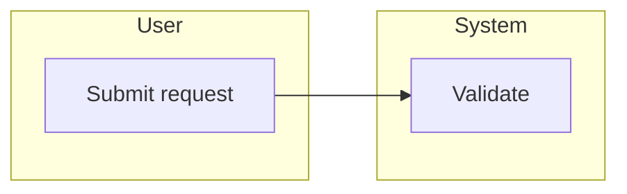
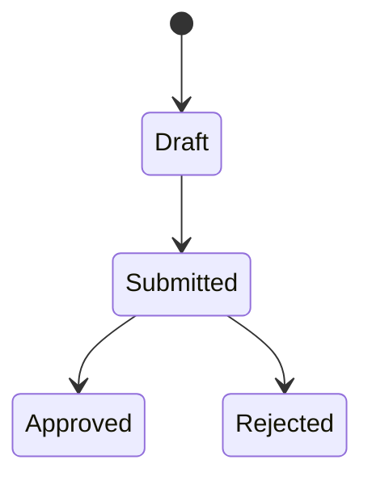
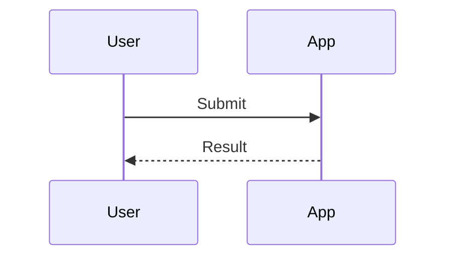

# Diagram Patterns

## Selection Discipline

Choose one purpose per diagram file:

- Process or user task flow -> flowchart.
- Role, team, system, or client-surface handoff -> swimlane-style flowchart with subgraphs.
- Status lifecycle -> state diagram.
- Time-ordered system or actor interaction -> sequence diagram.
- System relationship -> architecture diagram.
- Feature or concept breakdown -> mind map.

Split the output when the request mixes product flow, state lifecycle, API sequence, data model, roadmap, or delivery plan. Do not create a dense all-in-one diagram.

## Flowchart

Use for steps and decisions.

## Swimlane-Style Flow

Mermaid does not have a native swimlane primitive. Use subgraphs for lanes.

Use real actors, teams, systems, or client surfaces as lanes. Avoid vague lanes such as "Product", "Tech", or "Operation" unless the source material explicitly defines those as responsible actors.

## State Diagram

Use for lifecycle transitions.

## Sequence Diagram

Use for time-ordered interactions.

