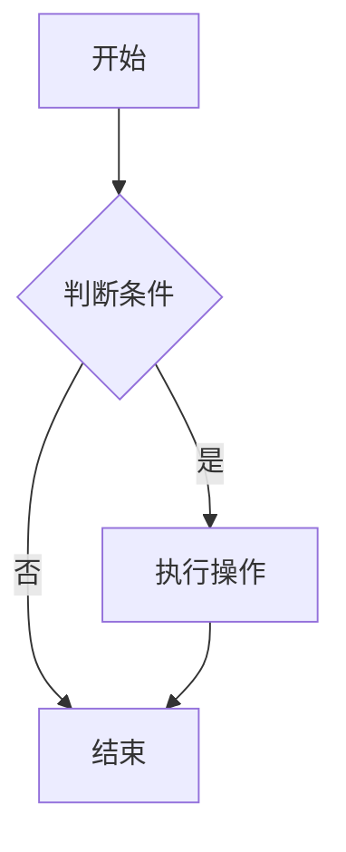
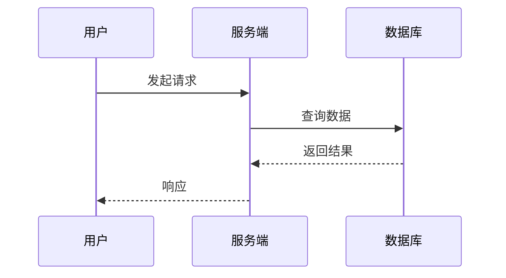
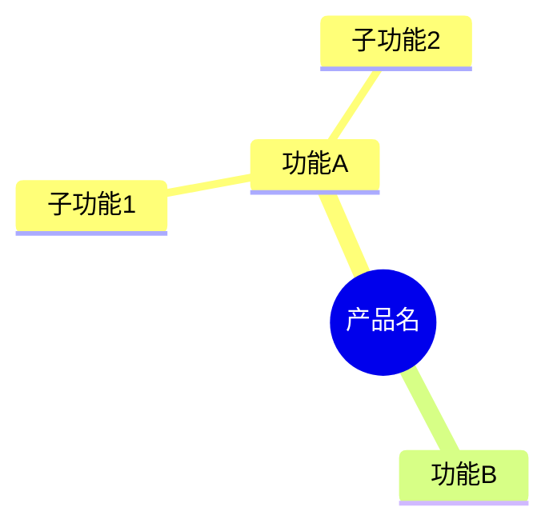

# Mermaid 图表生成器

用这个 skill 把文字描述转成有效的 Mermaid 图表代码。

## 图表类型选择

| 需求 | 推荐类型 | Mermaid 关键字 |
|------|----------|----------------|
| 业务流程 / 逻辑流程 | 流程图 | `flowchart TD` |
| 跨角色流程 / 责任分工 / 泳道图 | 泳道图 | `swimlane-beta LR` |
| 系统交互 / API 时序 | 时序图 | `sequenceDiagram` |
| 产品架构 / 系统结构 | 流程图 / C4 | `flowchart LR` |
| 状态机 / 用户状态 | 状态图 | `stateDiagram-v2` |
| 脑图 / 功能树 | 脑图 | `mindmap` |
| 数据库结构 | ER 图 | `erDiagram` |
| 项目时间线 | 时间线 | `timeline` |
| 用户旅程 | 用户旅程图 | `journey` |

## 输出规则

1. 始终使用 ` ```mermaid ` 代码块包住结果。
2. 用户用中文表达时，图里的节点也用中文。
3. 复杂图可以加 `%%` 注释解释分区。
4. 节点名称尽量短，最好不超过 10 个汉字，避免图太挤。
5. 用户说“泳道图、跨角色流程、责任分工、谁负责哪一步”时，优先使用 `swimlane-beta`。
6. 如果目标环境不支持 `swimlane-beta`，降级为 `flowchart LR` + `subgraph` 表达泳道。
7. 输出前做语法自检，常见问题包括：
   - 含空格或中文的标签没有加引号。
   - 箭头写错，例如 `-->`、`---`、`->>` 混用。
   - 括号、方括号或大括号没有闭合。

## 泳道图规则

- 用 `swimlane-beta LR` 表达横向泳道，用 `swimlane-beta TB` 表达纵向泳道。
- 每个泳道用 `subgraph 泳道名` 定义；如果泳道名称包含空格或需要稳定 ID，用 `subgraph id [展示名]`。
- 节点写在拥有该动作或决策的泳道里；跨泳道箭头就是责任交接点。
- 跨泳道交接如果依赖材料、消息、判断或状态变化，要给箭头加标签。
- 决策节点放在真正做决策的泳道，不要为了排版随便移动。

## 快速语法参考

```mermaid
swimlane-beta LR
  subgraph 用户
    submit[提交申请]
    revise[补充资料]
  end

  subgraph 运营
    review{资料完整?}
    approve[人工审核]
  end

  subgraph 系统
    create[创建工单]
    notify[通知结果]
  end

  submit --> create --> review
  review -->|否| revise --> submit
  review -->|是| approve --> notify
```







## 参考文件

- `references/diagram-patterns.md`：产品经理常用图模式，包含完整示例代码，含泳道图示例。

当用户指定图表类型，或需要复杂多节点图时，读取这个参考文件。
