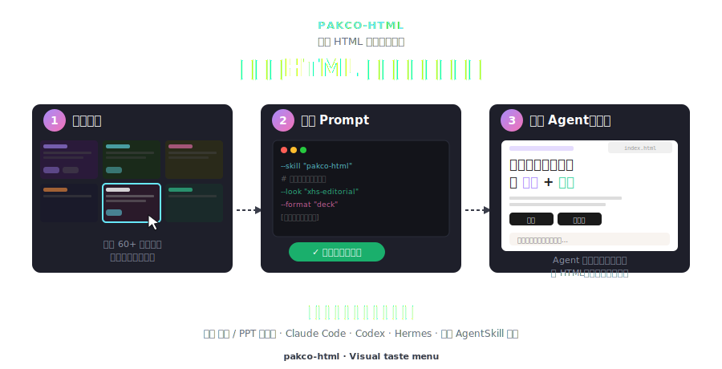

# pakco.html · 给 AI Agent 用的视觉审美菜单

[中文](README.zh-CN.md) · [**English →**](README.md)

[](LICENSE)



**别再描述审美，直接选。**

本地优先的视觉菜单——浏览 60+ 种真实预览，点一张卡，拿到可执行 Prompt。粘给 Claude Code / Codex / Hermes，Agent 按你选的视觉约束生成 deck。

## ▶ 快速开始

### Codex

在 Codex 里直接说：

```text
帮我从 GitHub 安装这个 skill：https://github.com/pakco77/pakco-html
使用仓库根目录作为 skill 路径，安装名用 pakco-html。
```

或者在终端安装：

```bash
curl -fsSL https://raw.githubusercontent.com/pakco77/pakco-html/refs/heads/main/scripts/install-codex.sh | bash

# 起本地服务器，加载 iframe 实时预览
cd ~/.codex/skills/pakco-html && python3 -m http.server 8000
# 访问：http://localhost:8000/templates/style-picker.html
```

安装后重启 Codex，让它重新加载技能列表。

### Claude Code / AgentSkill CLI

```bash
npx skills add https://github.com/pakco77/pakco-html

# 起本地服务器，加载 iframe 实时预览
cd ~/.claude/skills/pakco-html && python3 -m http.server 8000
# 访问：http://localhost:8000/templates/style-picker.html
```

### 其它 AgentSkill Agent

`skills` CLI 已支持的 Agent，可以直接指定 agent：

```bash
npx skills add https://github.com/pakco77/pakco-html --agent kimi-code-cli
npx skills add https://github.com/pakco77/pakco-html --agent qwen-code
npx skills add https://github.com/pakco77/pakco-html --agent gemini-cli
```

如果某个 Agent 读取本地 `SKILL.md` 目录，但不在 CLI 支持列表里，用通用安装脚本：

```bash
curl -fsSL https://raw.githubusercontent.com/pakco77/pakco-html/refs/heads/main/scripts/install-agent.sh | bash -s -- workbuddy
curl -fsSL https://raw.githubusercontent.com/pakco77/pakco-html/refs/heads/main/scripts/install-agent.sh | bash -s -- ~/.some-agent/skills/pakco-html
```

通用脚本内置 `codex`、`claude`、`kimi`、`qwen`、`gemini`、`kiro`、`cursor`、`hermes`、`codebuddy`、`workbuddy`。

点卡片 → Prompt 已复制 → 粘给 Agent → 完事。

## 📦 内容一览

| 标签页 | 说明 | 数量 |
|---|---|---|
| 🎨 皮肤 | CSS 换皮，共享布局 | 36 |
| 📑 模板 | 完整 deck——横版演示 & 纵向页面 | 23 |
| 🧩 UI Taste | UI 风格系统 | 4 |
| 🖼 图文 | 社交图文基调 + deck 模板 | 4 基调 |

另有 31 种单页布局、27 个 CSS 动画、20 个 Canvas FX、演讲者模式（`S` 键）。

## 🙏 致敬上游

视觉功劳属于上游作者，本仓库是封装 + 选择器层：

- 🎨 [lewislulu/html-ppt-skill](https://github.com/lewislulu/html-ppt-skill) — 核心 skill：皮肤、布局、动效、runtime
- 🪶 [op7418/guizang-ppt-skill](https://github.com/op7418/guizang-ppt-skill) — 电子杂志 & 瑞士国际主义模板
- 🖼 [op7418/guizang-social-card-skill](https://github.com/op7418/guizang-social-card-skill) — 社交图文系统
- 🧩 [Leonxlnx/taste-skill](https://github.com/Leonxlnx/taste-skill) — UI 审美系统

## 协议

MIT © 2026 lewis。上游 skill 各自保留其许可。
