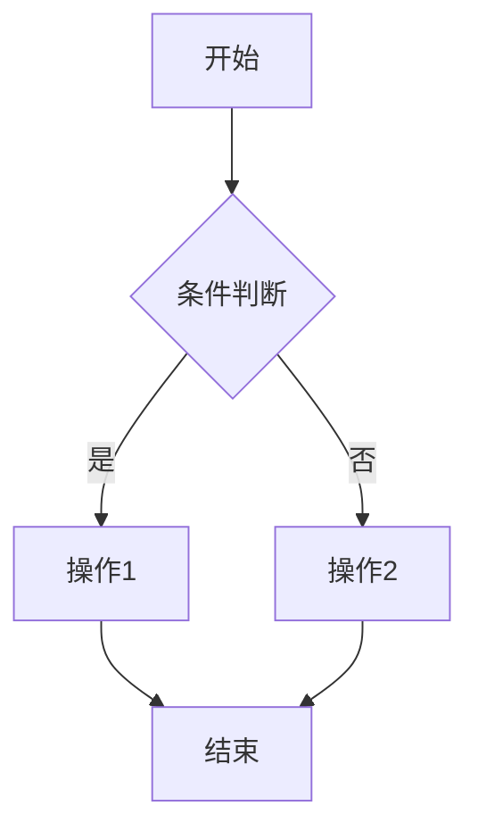
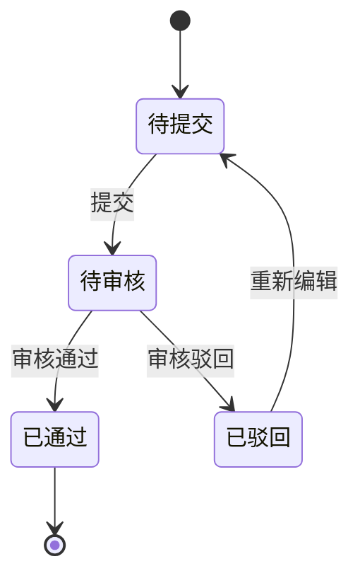

# PRD 模板（10 段式）

> 每个功能模块的 PRD 需按以下 10 个部分撰写，不得省略。
> PRD 的目标不是解释概念，而是输出研发、测试、运维和业务都能直接协同的执行底稿；凡是不能落到页面、接口、字段、状态、异常码或验收点的内容，都不能算完整。

## 0. 文档信息

- 标题：
- 文档类型：PRD
- 版本：
- 日期：
- 作者：
- 相关方：

## 写作前检查（不计入 10 段式正文）

- 目标系统是否已确认：`OMS` / `WMS` / `TMS`
- 若需求涉及库存变动、库存占用/释放、扣减/回补、调拨或出入库，必须先确认库存责任归属
- 若需求涉及仓储或物流联动作业，必须同时确认作业节点/状态口径、是否手工单、物流商揽收系统/TMS 交接口径，以及哪些状态仅为后台流转不单列为业务场景
- 需求分析、Plan、原型阶段的待确认项必须全部清零，且确认后的内容必须回填到对应章节，才能进入 PRD
- 如果某一段只能说业务概念，不能落到研发可执行对象，视为未完成

---

## 一、功能定义

- **功能入口**：（路径/菜单位置）
- **功能说明**：（一句话描述这个模块做什么）
- **使用角色**：（管理员端 / 客户端 / 其他）

---

## 二、业务规则（逻辑是什么）

### 2.1 核心规则
- 触发条件：（什么情况下触发）
- 计算公式：（如有计算逻辑）

### 2.2 特殊场景处理
- 边界情况：（如空数据、极值）
- 异常场景：（如网络异常、数据冲突）

---

## 三、流程说明（业务流程是什么）

> 所有流程必须使用 Mermaid 语法绘制。

### 3.1 主流程（正常业务流程）

### 3.2 创建场景
- 什么时候产生数据
- 数据初始化规则

### 3.3 失效/关闭/完结场景
- 什么时候数据状态变化
- 状态变化触发条件

### 3.4 分支流程
- 不同条件下的分支处理

### 3.5 异常流程
- 操作失败的处理路径
- 异常回滚机制

---

## 四、数据来源与口径（取值从哪来）

### 4.1 关键数据来源

| 数据对象/关键字段 | 来源类型 | 说明 |
|--------|---------|------|
| 示例对象 | 数据表 / 关联档案 / 主数据 / 外部系统 / 计算派生 | 说明 |

### 4.2 枚举值定义

| 枚举值 | 显示文案 | 颜色 | 适用范围 |
|--------|---------|------|---------|
| 0 | 待处理 | #FF9900 | 管理员端/客户端 |
| 1 | 已处理 | #52C41A | 管理员端/客户端 |

---

## 五、页面交互（交互是什么）

> **UI 规范（强制）**：本章节所有界面描述必须参照 Ant Design Pro 组件库规范，使用标准组件名称描述界面元素，不得使用通用提法。
>
> - 查询区 → 使用 **Form + Input / Select / DatePicker / Cascader** 等组件描述，不得写"输入框"、"下拉框"
> - 列表 → 使用 **Table** 组件描述，列配置、分页、排序、筛选必须对齐 Table 属性
> - 状态展示 → 使用 **Tag / Badge** 组件描述，必须注明颜色值
> - 操作按钮 → 使用 **Button** 组件描述，必须注明 `type`（primary / default / danger / link）
> - 弹窗/抽屉 → 使用 **Modal / Drawer** 组件描述，不得写"弹窗"、"对话框"
> - 详情展示 → 使用 **Descriptions / Card** 组件描述
> - 提示反馈 → 使用 **Message / Notification / Result** 组件描述
>
> 参考网址：https://ant.design/index-cn
>
> 未按本规范描述的界面内容，视为 PRD 未完成。

### 5.1 查询条件

| 条件字段 | 控件类型 | 筛选逻辑 | 默认值 | 联动行为 |
|---------|---------|---------|--------|---------|
| 示例条件 | 下拉框/日期范围/输入框 | 精确匹配/模糊匹配/范围 | - | 选择A后联动刷新B |

### 5.2 列表结构

| 列名 | 列说明 | 默认排序 |
|------|--------|---------|
| 示例列 | 字段说明 | 倒序/正序 |

### 5.3 汇总统计

| 统计项 | 数据来源 | 计算公式 | 刷新时机 |
|--------|---------|---------|---------|
| 示例统计 | 数据表 | SUM/AVG/COUNT | 页面加载/筛选后 |

### 5.4 Tab/状态筛选

| Tab名称 | 筛选条件 | 角标规则 |
|---------|---------|---------|
| 全部 | 无 | 显示总数 |
| 待处理 | status=0 | 显示待处理数量 |

### 5.5 操作按钮

| 按钮名称 | 样式 | 权限 | 说明 |
|---------|------|------|------|
| 提交 | 主按钮 | 编辑权限 | 提交当前表单 |

---

## 六、操作后发生什么

### 6.1 操作执行顺序
- 提交/审核/取消等操作的执行步骤

### 6.2 成功/失败提示
- 成功提示文案
- 失败提示文案及错误码

### 6.3 页面刷新/跳转行为
- 操作成功后页面如何变化

### 6.4 操作触发的系统行为

> ⚠️ 本节只能描述业务级行为，不能写具体表名、字段名或技术实现细节。技术实现由技术设计文档定义。

| 操作 | 触发的数据变更（业务描述）| 触发关联行为（业务描述）|
|------|------------------------|----------------------|
| 示例操作 | 新增/更新/删除某业务记录 | 自动生成某业务对象；自动发送某通知 |

---

## 七、约束与限制（额外的限制是什么）

- **输入长度**：（如：名称最多50字符）
- **数值范围**：（如：金额必须 > 0）
- **日期约束**：（如：结束日期必须 > 开始日期）
- **权限控制**：（哪些角色能看/能操作）
- **特殊规则**：（如：海外调拨不冻结）

---

## 八、状态机（如有多状态流转）

### 8.1 状态流转图

### 8.2 状态说明

| 状态 | 触发条件 | 是否终态 | 说明 |
|------|---------|---------|------|
| 待提交 | 数据创建后 | 否 | 初始状态 |
| 待审核 | 用户提交后 | 否 | 等待审核 |
| 已通过 | 审核通过后 | 是 | 终态 |
| 已驳回 | 审核驳回后 | 否 | 可重新编辑 |

---

## 九、用例（UC）

### 9.1 正常路径用例

| 用例编号 | 用例描述 | 前置条件 | 操作步骤 | 预期结果 |
|---------|---------|---------|---------|---------|
| UC-001 | 正常创建 | 用户已登录 | 1. 进入页面 2. 填写表单 3. 提交 | 创建成功，状态变为待审核 |

### 9.2 边界用例

| 用例编号 | 用例描述 | 前置条件 | 操作步骤 | 预期结果 |
|---------|---------|---------|---------|---------|
| UC-002 | 空数据提交 | 用户已登录 | 1. 不填必填项 2. 提交 | 前端拦截，提示必填 |

### 9.3 异常用例

| 用例编号 | 用例描述 | 前置条件 | 操作步骤 | 预期结果 |
|---------|---------|---------|---------|---------|
| UC-003 | 权限不足 | 无权限用户 | 1. 进入页面 | 提示无权限，禁止访问 |

---

## 十、数据说明

> 本章承接需求分析阶段的数据说明，聚焦关键数据对象、来源、流向、状态和关系。
> **对于供应链 WMS/OMS/TMS 系统，§10.4 字段清单为每个功能模块的必填项**，不得省略；字段清单是研发建表和接口设计的最直接依据。

### 10.1 关键数据对象

| 数据对象 | 说明 | 来源 | 流向/用途 |
|----------|------|------|-----------|
| 示例对象 | 示例说明 | 示例来源 | 示例用途 |

### 10.2 枚举与状态口径

| 名称 | 显示文案 | 适用范围 | 说明 |
|------|---------|---------|------|
| 示例状态 | 待处理 | 管理员端/客户端 | 示例说明 |

### 10.3 数据关联关系

| 关系名称 | 左侧对象 | 右侧对象 | 关系类型 | 说明 |
|----------|----------|----------|----------|------|
| 示例关系 | 示例对象A | 示例对象B | 1:N | 示例说明 |

### 10.4 字段清单（必填）

> ⚠️ 本节只能包含业务级字段定义，不能包含数据类型、数据库约束等技术细节。技术细节由技术设计文档定义。
>
> 对于供应链 WMS/OMS/TMS 系统，字段清单是研发理解业务数据的最直接依据，不得省略。

| 字段名 | 业务名称 | 必填 | 业务规则 | 说明 |
|--------|---------|------|---------|------|
| 示例字段 | 示例业务名称 | 是/否 | 长度限制、格式校验、枚举值、唯一性约束等 | 示例说明 |

**字段说明：**

- **字段名**：数据对象的英文/技术字段名（供研发建表时参考，但 PRD 不定义数据类型）
- **业务名称**：字段在页面上的显示名称
- **必填**：创建记录时是否必须填写
- **业务规则**：长度限制、格式校验规则、枚举值列表、唯一性约束、默认值规则等
- **说明**：字段的用途、取值来源、特殊说明等

## 十一、确认结论

- PRD 是否确认：待用户确认
- 进入下一阶段条件：用户明确确认 PRD 后，交付物归档，项目进入研发排期阶段
